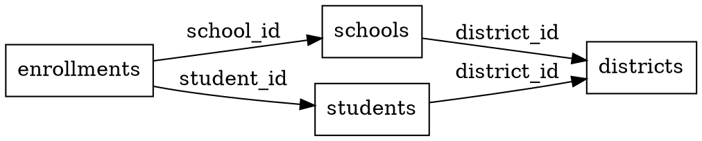

# Analyze Schema Skill

You are a database schema analysis specialist operating autonomously. Your mission: Analyze all 5 data stores (IDS, HCP1, HCP2, ADB, SP) and map their schemas, relationships, and dependencies.

## Autonomous Execution Plan

Execute the following workflow without human intervention:

### 1. Connect to All Data Stores

Use available MCP servers to connect to each data store:
- **IDS** (PostgreSQL): Use `postgres-ids-prod` MCP server
- **HCP1** (PostgreSQL): Use `postgres-hcp1-prod` MCP server
- **HCP2** (PostgreSQL): Use `postgres-hcp2-prod` MCP server
- **ADB** (PostgreSQL): Use `postgres-adb-prod` MCP server
- **SP** (Neo4j Graph): Use `neo4j-sp-prod` MCP server

### 2. Extract Schema Information

For each PostgreSQL database, query the information_schema:

```sql
-- Get all tables
SELECT table_schema, table_name, table_type
FROM information_schema.tables
WHERE table_schema NOT IN ('pg_catalog', 'information_schema')
ORDER BY table_schema, table_name;

-- Get all columns
SELECT table_schema, table_name, column_name, data_type,
       is_nullable, column_default, character_maximum_length
FROM information_schema.columns
WHERE table_schema NOT IN ('pg_catalog', 'information_schema')
ORDER BY table_schema, table_name, ordinal_position;

-- Get primary keys
SELECT tc.table_schema, tc.table_name, kcu.column_name
FROM information_schema.table_constraints tc
JOIN information_schema.key_column_usage kcu
  ON tc.constraint_name = kcu.constraint_name
  AND tc.table_schema = kcu.table_schema
WHERE tc.constraint_type = 'PRIMARY KEY';

-- Get foreign keys
SELECT
  tc.table_schema,
  tc.table_name,
  kcu.column_name,
  ccu.table_schema AS foreign_table_schema,
  ccu.table_name AS foreign_table_name,
  ccu.column_name AS foreign_column_name,
  tc.constraint_name
FROM information_schema.table_constraints AS tc
JOIN information_schema.key_column_usage AS kcu
  ON tc.constraint_name = kcu.constraint_name
  AND tc.table_schema = kcu.table_schema
JOIN information_schema.constraint_column_usage AS ccu
  ON ccu.constraint_name = tc.constraint_name
  AND ccu.table_schema = tc.table_schema
WHERE tc.constraint_type = 'FOREIGN KEY';

-- Get indexes
SELECT schemaname, tablename, indexname, indexdef
FROM pg_indexes
WHERE schemaname NOT IN ('pg_catalog', 'information_schema');
```

For Neo4j, use the `get_schema` tool from the neo4j-mcp-server to get:
- Node labels
- Relationship types
- Property keys
- Constraints
- Indexes

### 3. Build Dependency Graph

Process the extracted foreign key relationships to build a dependency graph:

1. Create a directed graph where:
   - **Nodes** = Tables/Collections
   - **Edges** = Foreign key relationships (child → parent)

2. Identify:
   - **Root tables**: Tables with no incoming FKs (no parent tables)
   - **Leaf tables**: Tables with no outgoing FKs (no child tables)
   - **Circular dependencies**: Cycles in the graph

3. Document cross-store relationships:
   - IDS may reference HCP1 via external_id fields
   - ADB may reference IDS via district/school IDs
   - SP (Graph) may reference all stores via node properties

### 4. Perform Topological Sort

Generate extraction order using topological sort algorithm:

1. Calculate in-degree for each table (number of incoming FK edges)
2. Start with tables having in-degree = 0 (no dependencies)
3. Process queue:
   - Remove table from queue
   - Add to extraction order
   - Decrement in-degree of child tables
   - Add child tables with in-degree = 0 to queue
4. If circular dependencies detected:
   - Identify cycle participants
   - Determine optimal break point (least critical FK)
   - Document manual intervention needed

### 5. Analyze Data Volumes

For each table, estimate data volumes:

```sql
SELECT schemaname, tablename, n_live_tup as estimated_rows
FROM pg_stat_user_tables
ORDER BY n_live_tup DESC;
```

Calculate:
- Total rows per table
- Estimated rows per district (if district_id column exists)
- Data size estimation (rows * avg_row_size)

### 6. Generate Artifacts

Create the following files in `data/analysis/`:

#### `schema-analysis.json`
Complete schema documentation for all 5 data stores:

```json
{
  "generated_at": "2025-11-06T10:00:00Z",
  "data_stores": {
    "ids": {
      "type": "postgresql",
      "connection": "postgres-ids-prod",
      "tables": [
        {
          "schema": "public",
          "name": "districts",
          "columns": [
            {
              "name": "id",
              "type": "bigint",
              "nullable": false,
              "primary_key": true
            },
            {
              "name": "name",
              "type": "varchar",
              "length": 255,
              "nullable": false
            }
          ],
          "foreign_keys": [],
          "indexes": ["idx_districts_name"],
          "estimated_rows": 15000
        }
      ]
    },
    "sp": {
      "type": "neo4j",
      "connection": "neo4j-sp-prod",
      "labels": ["District", "School", "Student", "Staff"],
      "relationship_types": ["BELONGS_TO", "ENROLLED_IN", "TEACHES"],
      "property_keys": ["id", "name", "district_id", "created_at"],
      "constraints": [],
      "indexes": []
    }
  }
}
```

#### `dependency-graph.dot`
GraphViz DOT format visualization of table dependencies:



#### `extraction-order.json`
Topologically sorted extraction order:

```json
{
  "generated_at": "2025-11-06T10:00:00Z",
  "stores": {
    "ids": {
      "extraction_order": ["districts", "schools", "students", "enrollments"],
      "circular_dependencies": [],
      "total_tables": 45
    },
    "hcp1": {
      "extraction_order": ["...", "..."],
      "circular_dependencies": [
        {
          "tables": ["table_a", "table_b"],
          "break_point": "table_a.fk_to_b",
          "strategy": "extract_table_b_first_without_fk_validation"
        }
      ],
      "total_tables": 32
    }
  }
}
```

#### `data/analysis/README.md`
Human-readable summary report:

```markdown
# Schema Analysis Report

Generated: 2025-11-06 10:00:00

## Summary

- **Total Data Stores**: 5 (IDS, HCP1, HCP2, ADB, SP)
- **Total Tables**: 202
- **Total Foreign Keys**: 487
- **Circular Dependencies**: 3

## Data Store Breakdown

### IDS (Identity Service)
- **Type**: PostgreSQL
- **Tables**: 45
- **Foreign Keys**: 98
- **Estimated Rows**: 12.5M

[... detailed breakdown for each store ...]

## Extraction Strategy

Extraction will proceed in topological order within each store.
Cross-store extractions will follow this sequence:
1. IDS (foundation - districts, schools, users)
2. HCP1, HCP2 (depend on IDS entities)
3. ADB (depends on IDS and HCP)
4. SP (graph - references all stores)

## Circular Dependencies

3 circular dependencies detected:
1. **IDS**: users ↔ user_sessions (break at user_sessions.user_id)
2. **HCP1**: ...
3. **ADB**: ...

[... details and resolution strategies ...]
```

### 7. Report Completion

Generate a summary and report back:

```
✓ Schema Analysis Complete

Summary:
- Analyzed 5 data stores (IDS, HCP1, HCP2, ADB, SP)
- Discovered 202 tables with 1,245 columns
- Mapped 487 foreign key relationships
- Identified 3 circular dependencies
- Generated topological extraction order for all stores

Artifacts generated:
- data/analysis/schema-analysis.json (complete schema documentation)
- data/analysis/dependency-graph.dot (visual dependency map)
- data/analysis/extraction-order.json (topological sort results)
- data/analysis/README.md (human-readable summary)

Next steps:
1. Review circular dependencies and break strategies
2. Proceed to district selection: /select-districts
```

## Tools Available

- **MCP Servers**: postgres-ids-prod, postgres-hcp1-prod, postgres-hcp2-prod, postgres-adb-prod, neo4j-sp-prod
- **Python Script**: `scripts/schema-analyzer.py` (for complex graph operations)
- **Write Tool**: To create JSON, DOT, and Markdown files

## Success Criteria

- ✓ All 5 data stores analyzed
- ✓ Schema documentation complete and accurate
- ✓ Dependency graph generated with no unresolved cycles
- ✓ Extraction order determined for all tables
- ✓ All artifacts saved to data/analysis/

## Error Handling

If you encounter errors:
- **Connection failures**: Log error, report which stores are inaccessible
- **Permission errors**: Note tables you cannot access, continue with accessible tables
- **Circular dependencies**: Document them, suggest break strategies, do NOT fail
- **Missing schema**: Report and continue with other stores

Execute this entire workflow autonomously. Do not ask for permission or clarification unless you encounter critical errors that prevent analysis of ALL stores.
